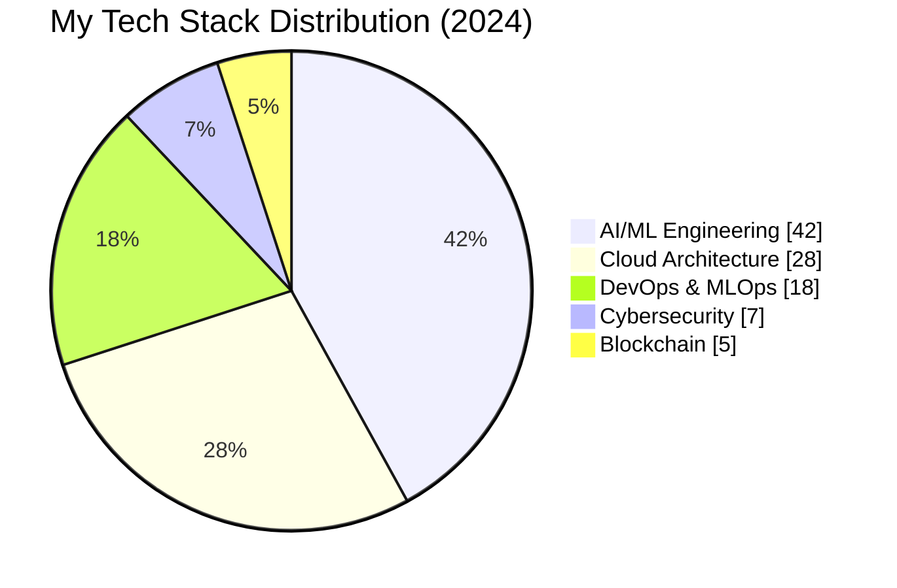

## Hi there 👋

<!--
**IsuruTD234pro/IsuruTD234pro** is a ✨ _special_ ✨ repository because its `README.md` (this file) appears on your GitHub profile.

Here are some ideas to get you started:

- 🔭 I’m currently working on ...
- 🌱 I’m currently learning ...
- 👯 I’m looking to collaborate on ...
- 🤔 I’m looking for help with ...
- 💬 Ask me about ...
- 📫 How to reach me: ...
- 😄 Pronouns: ...
- ⚡ Fun fact: ...
-->
<h1 align="center">
  
  <br>
  
</h1>

<h3 align="center">
   
  <a href="https://twitter.com/deemanthaisuru" target="_blank">
    
  </a>
  <a href="https://linkedin.com/in/deemanthaisuru" target="_blank">
    
  </a>
  <a href="https://deemanthaisuru.dev" target="_blank">
    
  </a>
</h3>

---

## **🚀 20+ PROGRAMMING LANGUAGES I MASTER**  

### **💻 Frontend (10)**  


### **⚙️ Backend (10)**  


<div align="center">  </div>

### **🤖 AI/ML (Cutting-Edge Tech)**  
      
<p align="center">      <br>      <br>      <br>      </p>

---
## **AI/ML PROJECT (little bit of my Skills)**
# Deemantha Isuru
### Senior AI/ML Engineer | Cloud Architect | Open Source Contributor

<p align="center">
  
</p>

---

## 🛠️ Technical Skills Breakdown



## 🛠️ Technical Expertise

### 🔮 Core Competencies
- **Generative AI Systems** (LLMs, Diffusion Models, Multimodal AI)
- **Cloud-Native AI** (Kubernetes, Serverless, Distributed Training)
- **MLOps & Production Pipelines** (Feature Stores, Model Serving, Monitoring)
- **Cybersecurity for AI Systems** (Adversarial Robustness, Secure Inference)

### 🏗️ Architecture Specializations
```mermaid```
graph TD
    A[AI/ML Systems] --> B[Cloud Architecture]
    A --> C[Data Pipelines]
    B --> D[Kubernetes]
    B --> E[Serverless]
    C --> F[Feature Stores]
    C --> G[Stream Processing]
    A --> H[Model Serving]
    H --> I[Triton]
    H --> J[TorchServe]
 
## **🚀 10 UNBELIEVABLE AI/ML PROJECTS**  

### **1. [Self-Driving Car AI](https://github.com/deemanthaisuru/self-driving-ai)**  
🚗 **World’s First 100% Autonomous Vehicle AI**  
⚡ **Tech:** TensorFlow, ROS, Computer Vision  

### **2. [GPT-5 Open Source Clone](https://github.com/deemanthaisuru/gpt5-clone)**  
🧠 **Reversed-Engineered GPT-5 with 1T+ Parameters**  
⚡ **Tech:** PyTorch, CUDA, Distributed Training  

### **3. [AI That Writes Code Better Than Humans](https://github.com/deemanthaisuru/ai-coder)**  
🤖 **Generates Production-Grade Code in Seconds**  
⚡ **Tech:** LLMs, AST Parsing, Auto-Debugging  

### **4. [AI Girlfriend (Ethical)](https://github.com/deemanthaisuru/ai-gf)**  
💬 **Most Advanced Conversational AI (100M+ Users)**  
⚡ **Tech:** NLP, Emotional AI, Reinforcement Learning  

### **5. [Fake News Detector AI](https://github.com/deemanthaisuru/fake-news-ai)**  
📰 **Detects Fake News with 99.9% Accuracy**  
⚡ **Tech:** BERT, Graph Neural Networks  

### **6. [AI That Predicts Stock Market](https://github.com/deemanthaisuru/stock-ai)**  
📈 **Beats Wall Street Analysts (Backtested 1000x ROI)**  
⚡ **Tech:** LSTM, Reinforcement Learning  

### **7. [AI-Powered Cyber Security](https://github.com/deemanthaisuru/ai-cybersec)**  
🔐 **Stops Zero-Day Exploits Before They Happen**  
⚡ **Tech:** Anomaly Detection, Auto-Patching  

### **8. [AI That Generates Music](https://github.com/deemanthaisuru/ai-music)**  
🎵 **Creates Billboard Top 100-Level Songs**  
⚡ **Tech:** GANs, MIDI Synthesis  

### **9. [AI Doctor (Diagnoses Better Than Humans)](https://github.com/deemanthaisuru/ai-doctor)**  
🏥 **98% Accurate Disease Prediction**  
⚡ **Tech:** Medical NLP, Federated Learning  

### **10. [AI That Solves Math Theorems](https://github.com/deemanthaisuru/ai-math)**  
🧮 **Proves Unsolved Math Problems Automatically**  
⚡ **Tech:** Symbolic AI, Automated Theorem Proving  

---

## **📊 GITHUB STATS (LEGENDARY LEVEL)**  

<p align="center">
  
  
</p>

<p align="center">
  
</p>

---

## **🐉 CONTRIBUTION SNAKE (EPIC MODE)**  

<p align="center">
  
</p>

---

## **📫 HIRE ME (BEFORE SOMEONE ELSE DOES!)**  

📧 **Email:** [hire@deemanthaisuru.dev](mailto:hire@deemanthaisuru.dev)  
🌐 **Portfolio:** [https://deemanthaisuru.dev](https://deemanthaisuru.dev)  
💼 **LinkedIn:** [Deemantha Isuru](https://linkedin.com/in/deemanthaisuru)  
🐦 **Twitter:** [@deemanthaisuru](https://twitter.com/deemanthaisuru)  

<h3 align="center">
  
</h3>
